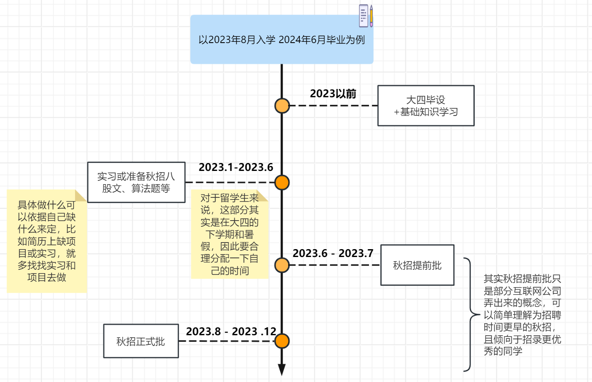

# 2019级-电信-柳煜翔（EE Msc @NUS）

## 基本背景

**本科专业：**电子信息学院-电子信息工程

**GPA&排名：**3.655/4.1 综测排名16

**标化成绩：**IELTS 6.0

**最终去向：**NUS EE(NUS311项目)

**联系方式：**欢迎加入飞跃群私聊呀 :D

**个人主页：**[https://blog.csdn.net/scarecrow_sun](https://blog.csdn.net/scarecrow_sun)

## 开头碎碎念

由于机缘巧合，看到了西工大飞跃手册。慕然回首，才发现大学四年已经匆匆流过。想把自己的这一段经历写下，希望在未来能给可能迷茫的你一些帮助。

由于本人水平有限，整段经历仅供参考。无论我这四年的经历中的某个选择在你的眼中是聪明亦或者愚蠢，但这就是我身上已经发生过的事情，是我的一个选择，这是我自己的一个人生。而你，我相信你自己的人生会因为你自己的选择而变得更加精彩且绚烂。

> ps：自己忍不住吐槽一句自己，其实人生不一定要精彩或绚烂，最主要的是不要太迷茫。我一直坚信，无悔的人生才是我们应该追求的人生。大部分人，只是普通人罢了：无需绚烂，但需无愧于本心。

## 本科毕业去向

我的最终去向是放弃了保研资格，选择了NUS的授课型硕士，EE专业，1年到2年灵活就读。相比于大佬们的毕业申请，亦或者是保研找导师的过程，我的这一个offer拿的应该算是平平无奇，或者甚至是一种走捷径的方法了。

而至于研究生之后去做什么， 初步打算直接参加工作。未来去新加坡之后，把自己去新加坡那边的经历甚至是工作的经历也补充进来(留个坑)

## NUS 311项目

本来在纠结要先写明一下自己的经历还是先介绍这个项目，思考半天，由于主题是飞跃手册，还是先把这个出国项目进行一个基本的介绍。

据我目前所知，西工大的HC，电信，机械，管理，物理均有新加坡国立大学的311项目，311项目是指大学前三年在西工大就读，大四前往新加坡国立大学苏州研究院就读一年，最后一年前往新加坡国立大学读授课型硕士。最终是西工大的本科文凭和新国大的硕士文凭。

### 申请条件

这个项目的基础申请条件是82分学分绩和不小于6.0的雅思成绩。我本人当时申请时学分绩88.5，雅思6.0。

雅思成绩只需要高于6即可，更高也不会加分，但是不能低于这个分数。由于本人的英语非常的烂，考了一次雅思，拿了一个6之后就没有再考了。

学习成绩是这个项目的最重要的部分，如果你们这一届学校里面申请的人极少，那么你可能82分就可以进入这个项目，但是如果申请的人比较多，那么你的竞争就会随着申请的人数增多而变得更加激烈。从功利化的角度来说，竞赛、论文、活动经历等等，对于这个项目来说没有任何用处，学习成绩就是那个最重要的部分(但是对于个人发展来说，就不是这样的了，我后面会再次阐述观点)。因此，如果你想参加这个项目，你的基础条件就是把学分绩刷高点，雅思够看就行(英语成绩能高点尽量还是高点，对于出国来说，英语好没有坏处)

### 项目评价

在我一年呆在苏州这边的经历来看，个人认为这个项目对于那些想尽早进入工作，或者是暂时不明确读博搞科研还是找工作的人来说是非常友好的。我将从以下几个方面来说一下自己的想法。

1. 同学，朋友圈子
2. 自由度
3. 花费开销
4. 跳板

从同学和朋友圈子来看，你其实可以将这个项目理解为一个过筛器，筛选出来的基本上是985和211大学，具有出国意向(家里负担得起)，且学习成绩不低于82分的人，从这个角度上来说，他筛出来了一批和你可能有类似环境，且在大学期间并没有彻底选择躺平的人。在这边，我能够看到的人感觉性格都非常的开朗，交际能力不差，学习能力强的人。并且有一个有意思的现象就是，健身人数占总人数的比例比我在西工大看到的要高。在这样的环境里，你是可以找到三观都比较契合的朋友，有放弃保研的大佬，有拿这个项目作为保底的大佬，有卷王。但是同样，我也不得不承认，这里也有水平并没有那么好、比较抽象的人。但现在的大学，很容易就能做到，你不想和一个人深入了解，你就能真的能从各个层面上屏蔽他。结交益友也不是难事。

从自由度来看，我认为这个项目的自由度是非常之高的。如果你想好好做研究，那就在苏州选择毕设的时候，找一个比较厉害的新国大的导师，然后多找导师问问题，多做出一些研究成果出来。如果你想读博，那就在毕设的时候找到你感兴趣的方向的老师，然后死死抓住大腿，带你读博。如果你想躺平，你也可以选择躺在宿舍睡一整天。如果你想出去旅游，见见更多城市，更多地方，你也可以选择在疫情放开后的现在，出去多玩几趟。如果你想实习，你也可以在苏州、南京、上海、杭州这附近的这些城市里面积极选择你心仪的实习岗位。无论你想做什么，我觉得在这边都是可以满足的。并且，有一个很主观的想法，相较于秦岭山脚的西工大，我会觉得苏州这边的创新氛围更好，科创企业更多，你的视野会变得更加开阔。除此之外，你如果对自己出国申请并没有过多的自信，那也可以选择这个项目作为保底，在苏州的一年里面继续申请外国学校，最终在前往新国大之前退出该项目，前往你自己更心仪的学校，这也是这个项目的灵活性所在。

从花费开销来看，来苏州之后的开销会比你在西工大的开销要多出一截，整个项目的学费也是比较贵的，新加坡一年加上苏州一年，需要准备50w左右。某个角度上来看，你可以把苏研院当成一个官方的中介机构，会花费一些钱，但是让你的出国变得简单一些(如果你并没有追求更牛的学校，更牛的导师，或者是心仪的研究方向)。

而如果你不知道想要读博科研还是直接就业，这个项目可以让你去新加坡读完硕士之后，再自己套磁申请博士，这都是可以的。

至于你是否选择这一个项目出国，我的建议是先思考清楚，你自己究竟想要什么，你大概会走一个什么样的路。

## 个人经历

我自认为我自己的学习能力并不强(但没有那么差)，应试能力也较差。我最庆幸的一点是，我在大一结束的时候，看清楚了这一点。大一的上学期，我每节课都坐在前三排，认真复习，认真完成作业，甚至对于那时候的我来说，没有水课这一说法，连军事理论这门课，我都一节课没翘过，甚至每节课坐在前三排，考前还认真复习了老师提到的所有知识点。但最终的结果是，军事理论以78的成绩结束了。甚至比不上朋友翘了一学期课，最后复习一周的效果高。

于是在大一下的时候，我认真思考了这样的一个问题，我到底想要什么，我到底想做什么，我喜欢的是什么？人生苦短，你难道真想在大学四年里面重复着预习，上课，复习，写作业的这样的生活吗？我花费了整整一个学期来思考这样一个问题，最终在机器人基地招新的时候，我认为我找到了答案，在大学期间，我想走机器人比赛这样一条道路。

从刚开始学习51单片机，arduino，STM32，到树莓派、NVidia Jeston系列，arch linux，Ubuntu，都随着进入WMJ基地，而不断学习着，我很庆幸我能参加这么一个机器人基地，给了我平台，给了我条件，让我看到了我感兴趣的东西。从大一下开始，到大三上结束，我参加了许多比赛，从最简单的校内的电子制作大赛，到工程能力实践大赛，到robomaster机甲大师，集成电路创新创业大赛等等。基本上有一年半的时间都在参加比赛中度过。我拿了一些奖，从省级一等奖到国家级一等奖。我熬了许多夜，通了很多宵。我认识了很多志同道合的朋友，我了解到了很多技术，从最简单的拧螺丝，到嵌入式硬件、软件，到视觉上层，人工智能。纯粹的技术学习是压抑的，会碰到很多bug，很多问题，但是一旦你解决掉了某个问题，那种纯粹的喜悦感却是任何东西都无法比拟的。

我的经历大概就是这样，我非常鼓励学弟学妹们尝试一下竞赛这条道路，虽然累，但是里面的乐趣真的很纯粹。

> 类似互联网+这种创业类项目，在我看来，西工大的这类比赛里面，只有寥寥几个项目是真正具有实力且真正想有所收获的(特指专业技能)。绝大部分的人都是为了水综测，我觉得单纯这一类的比赛像一种PPT大赛，无法提升自己。(当然，如果未来有创业想法的人，还是可以在这个比赛中获得支持和一些帮助)

说完了自己的经历，想说说自己在大学里面的一些思考和感悟。最核心的思想是，不要为了卷而卷。大学里面刚开始，老师和学长们开始宣传的往往都是某某学长学姐保研到了多好多好的学校，某某学长学姐凭借高的学分绩和绩点拿到了怎么样怎么样的绩点。我现在想说明的是，高绩点确实有很好的敲门砖作用，但是它不应该成为你大学期间的目标。驱动着你不断前进的是什么？是那一纸成绩单吗？我认为不是，而是你的兴趣，你的爱好，你自发想做的某一件事情。年级第一永远只有一个，不是年级第一就真的一无所长了吗？我认为的好的大学氛围绝对不是有人拼了命的卷，有人拼了命的摆(而我在西工大四年看到的情况就是这样)，好的大学氛围，应该是发现并思考自己所爱好的，自己所擅长的。我有朋友，为了保研名额，大学四年拼了命的学习课本知识，死记硬背，到最后自己都承认太痛苦了，太折磨了，不想学了，但是劝他停下学习，他说，不行，我不努力就拿不到保研资格，那我未来怎么办？我曾又问他，那你未来想做啥，得到的回答是，不知道，但我现在一定要先保研。我当时其实很纳闷，为啥要让自己拼了命的卷自己所不知道的东西。

那这样的话，就算你拿了保研资格又怎么样呢？

或者有人会说，你站着说话不腰疼，你不是也有保研资格吗。但是我参加比赛的过程中，压根没有觉得自己能够保研。自己在这段时间里面想到的就是，尽量把课本知识学到手，考试不要太差劲，剩下的时间精力都用在了比赛上了。而保研，我认为是参加比赛的副产品罢了。

## 给后来者的建议

我宣扬的是不要为了卷而卷，但并不等于堕落、摆烂，必要的努力还是需要做到。

我希望的是学弟学妹在大学期间多思考自己想做什么，最好能够发现自己的乐趣是什么。如果你发现了你的乐趣是什么，恭喜你，你已经足够幸运了，在这一步的基础上请思考一下自己想做什么，并且为了实现自己的这一个目标，自己需要做出一些什么样的努力：到大公司里面实习，补充自己的英语水平，提高自己的学分绩点，增加一下自己的奖状，强壮自己的体魄，或者尝试一些小项目，做做自媒体。但无论如何，请让这个目标是你发自内心且想去做的事情。

## 为什么参加这个项目出国？

最终选择放弃保研，而参加这个项目的原因有以下几点

1. 我已经确定，自己并没有科研的兴趣和想法，并不想去读博。自己英语成绩不够优秀，想用最稳定最保险最节省时间的方式拿到一个比较好的学校的硕士文凭即可
2. 想看看国外的教育水平和教育环境，提高自己的视野水平
3. 国内硬卷的环境让我有些不适

## 结语

无论如何，我的本科故事到此已经告一段落，我也不知道我的未来会发生什么，但我希望正在处于本科的你能够无愧于心，发现兴趣，并努力拼搏。不要把努力作为卷，也不要把不努力当成摆，为什么就不能为了自己所好，所爱而冲呢？

加油吧！

> ps.未来读完了研究生，有空会完善研究生阶段的经历。

------

# 读完研究生后的补充

现在是2024年的4月21日，距离我的学生生涯的最后一门考试结束还有三周。复习累了，想起自己留的坑，趁着学习累了，把这个坑慢慢填上。

新加坡的这一年说实话，非常平淡，不累，也不轻松。我想把研究生阶段的补充部分分成三个大块来描述，生活、学习以及秋招。由于我是明确不读博，打算一年直接毕业进入工作的，因此，秋招的经历占据了我整整上学期的几乎所有时间，也算是一些经验分享吧。

## 关于生活

说实话呆了一年了，还是觉得国内更舒服一些。

- "吃"：对于我个人而言，不太喜欢新加坡这边的饮食，出去找吃的，找半天好像就是那几样东西，吃到后面都腻了，都不太想吃了。
- "玩"：如果只看坡内的娱乐生活，真的太少了，几个比较热门的景点玩完之后感觉就没什么好玩的了，但是如果你是一个比较喜欢旅行的人，以新加坡作为中点，周边还是有非常多的国家可供你选择。
- "住"：一年的master基本上是申不到学生宿舍的，所以都是自己租房，这边的房价700-2000SGD都有，不同价位对应不同的房间和人数。血泪教训就是不要租一楼的房间，这边的杀虫虽然还可以，但是仍然逃不过蟑螂、飞虫以及各种其他不知名的虫子的骚扰。
- "行"：新加坡的公共交通非常方便，公交站与站之间挨得非常近。地铁也非常方便。新加坡有一点确实做的非常好的就是雨棚我感觉做的非常多，许多人行道都是有雨棚的，在暴雨天出门不带伞也不淋雨在这边完全有可能实现。

可能自己在这边一年都比较忙，没有很多时间去细细感受这边的生活细节，但一年四季如夏，时不时来一场大暴雨的这种气候有时候真的让人着迷，生活方面就写到这边，小红书上面关于本地的生活应该也是一搜一大把，我也就不再继续阐述了。

## 关于学习

我之前看到过很多人都会问一个问题，来苏州311值得吗，如果要我从现在来看，我觉得如果你有把握自己申上nus，311确实没有那么大的必要。311多一点的东西其实就是提前认识的这些朋友，在苏州一年比较悠闲的生活，以及名义上不允许实习，但实际上你去悄咪咪实习也没人管你的实习经验。但这一年的东西值不值得你去用8w(我那届是7w的苏州学费)来去买，这就见仁见智了。如果你成绩不差，语言也不错，那我建议可以不用多花这8w块钱，这一点和我一年前的看法大差不差。

如果要我说来新加坡值得吗，从我自身目标来看，是值得的。用金钱来换读研的时间我仍然觉得不亏。但你到底适不适合读一年硕，我建议还是从你自身目标和你自身实力出发，由于这一章是关于学习，先大概讲一讲这一年的学习生活。

NUS EE的msc要求你修够40个学分，也就是10门课就可以满足毕业，这10门课完成就视为自动毕业，如果你想要读1.5年，你就可以合理分配你的这40个学分要怎么安排。你也可以选择做项目，一般分为两种，一个是一个学期的项目，视为4个学分(一门课)，另一个是两个学期的大项目，视为8个学分(两门课)。一般课程内容都会分为前半part和后半part，中间穿插一个休息周，一般由两个老师教一门课。对于EE而言，基本上都是每半个part都有一次作业或者project亦或是quiz，然后加上期末考试来组成所有的分数。基本上老师不管你的上课通勤，最终成绩按照正态曲线来评级，也就是你需要和同班的同学互相竞争，project的难度和本科期间课设的难度类似，很多课能在GitHub上找到往届学长的代码来参考，但是期末考试就是有易有难，难的课是真的让人想死(提一嘴Robby的课是真的难QAQ)。如果你打算读1.5年，大部分都是第一学期修5门课，第二学期休4门课，最后一门课留到最后半年，并且在这半年在外实习拿实习经验。

在小红书上面说的，授课硕基本上不挂人的这种情况，我觉得不太认同，我已经看到了我这届身边有一个因为挂了一门课，导致必须读1.5年而导致失去秋招offer，也有朋友摆烂导致一学期最后突击两个星期却只收获2个C的情况。所以说摆烂真的会可能导致无法毕业。当然，选课的老师也占了一部分的比例，建议可以多问问学长学姐课程具体情况。

其实课程的知识并没有给我留下非常深刻的印象，印象更深的是老师们的上课方式，讲授思路，其他留学生的学习态度，交流氛围等等。极大的拓宽了我的视野，在这里我看到了很多优秀的认真的人，也看到了许多摆子。而NUS随处可见的椅子和学习的同学还有他们丰富多彩的校园生活，真的有点让人羡慕。这些对我的影响也很深刻。

然后就是MSC对于读博的帮助，从我看到的情况来看，MSC对于申博我觉得并不是一个加分项，身边申到好的博士的人都是可以直接读PHD的那部分同学，因此不建议抱着为了申博的态度来读一年硕，而应该早点在本科期间就接触科研，多把自己的科研履历搞的亮丽一些。或者不如直接申请研究硕，没有必要来读一个授课硕。这一点和我之前的想法还是有点出入，本来我认为的是311也可以适合想申博的同学，但现在来看我觉得并没有那么适合。

## 关于秋招

这一个part我会比较重点讲讲，因为对于这一部分我感受比较深把。先说个总结，一年硕对于秋招的帮助在于这一个学历可以成为很多工作的敲门砖，你可以说他不重要，因为敲开门了之后，能力才是你到底能不能进去的决定原因，你也可以说他重要，因为现在国内市场对于应届生来说，学历算是一个很大的门槛，决定你能否进入。自己大概投了60家左右，笔面大概30-40家不到，最终收获的offer还挺多挺不错的，零零总总有10个，因为自己走的方向是嵌入式，因此收获的offer都是偏向机器人，车企以及一些制造厂。最让我开心的是收到了稚晖君初创公司的offer，虽然最后没去，但是最终offer交流会上，身边的基本上都是国内外机器人行业顶级的一些学校的硕士了，所以说这个一年硕在找工作的认可度上是够的。

先说说我这届整体的我了解到的秋招情况：

说实话，我觉得秋招能不能拿到offer和你的能力占了很大一部分原因，我这届(一年毕业)由于比亚迪并没有大范围招人，甚至存在面完不发offer的情况，因此其实整体的就业能力我直观感受并不是很好，大部分人手上是0-3个offer左右，像我这种情况拿到挺多offer还能挑的情况极少，我了解到的能拿到最高薪资的应该是ME的一个在小红书上叫老张高手的同学，虽然我不认识，但听到朋友说是个非常卷的也非常厉害的做算法的人，最高薪资能到50-60w左右，大伙甚至可以看看他小红书的一些面经。身边很多拿不到offer的朋友大部分就是刚入学不知道工作方向到底要干什么，也没有什么准备，最后迷迷糊糊秋招时间就过去了，而今年春招也没有很多公司大规模招人，因此很多朋友会选择读1.5年。

如果你整体的项目或者能力并不够(指基本上没准备啥)，或者你甚至都还不知道你求职的工作方向，那我的建议是读1.5年，我的上一届读1.5年的学长学姐就基本上占到一半了，可见这个读1.5年还是很多朋友比较接受的。

然后再来细细说一下自己的秋招准备过程，希望对你有点帮助：

整个秋招的时间线我总结大概就是以下这个样子(针对一年硕毕业)

个人的经历或者说项目背景在去年写的那部分基本上都提过了，自己没有正式去实习过，但所幸比赛的项目经历比较丰富，目标比较明确，且准备比较早，因此能在最后可以收获比较多的offer。

对于我们EE而言，无论走前端后端还是嵌入式开发，基本上就是分为八股文+算法题，对于算法题我推荐可以按照代码随想录来刷题，而对于八股文，无非就是计网，计组，操作系统等等这种基础类的部分+你的专业相关的基础知识题，这一块推荐小林coding有比较全的成体系的一些八股文知识。当然运维IT产品经理这一块我身边也有朋友走，也能拿到不错的offer，但具体要怎么准备我就不太清楚了。

此外最重要的就是要早投，海投，增加自己的面试机会，磨练自己的笔面能力，才能最终拿到一个不错的offer。

> 当然，最重要的一定是要确定要走什么方向！！！

如果对于秋招还有疑惑，欢迎进群私聊噢！

## 结语

唔，感觉一年硕有很多东西，但一时半会又想不到还有什么了，就到此为止吧！也算是我的学生生涯画上了一个完美的句点。最后叠个甲，以上仅代表个人观点，如果不对，你说了算:D

祝大家前途似锦！一路顺风！